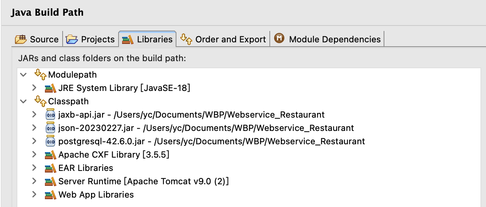
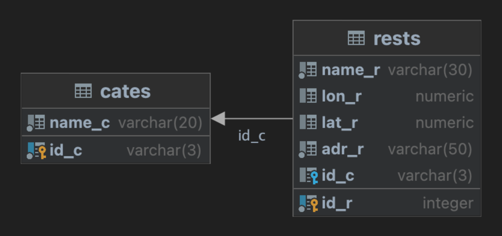
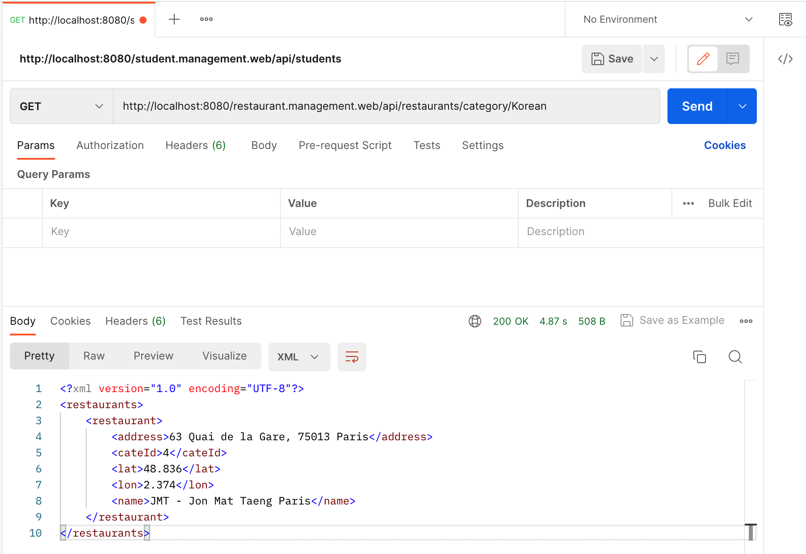
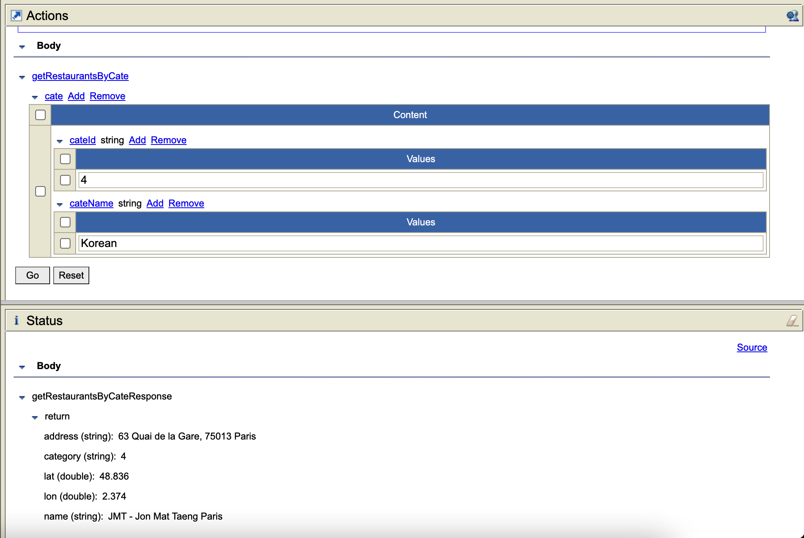

# **WebService (Restaurant Management Service)**
### Contributor and contact

This project has totally 2 contributors, **<u>Yicheng QIAN</u>** and **<u>Linxiang CONG</u>**. We have contributed all the codes for the project and we have uploaded the codes to Github to serve as an example for people who just started studying Web Service. The codes are already tested by the 2 contributors. If you find some errors or you have better solutions than ours. Please contact us by mail, we welcome.

Yicheng QIAN  :  yichengqian.czz@gmail.com

Linxiang CONG : Linxiangcong@outlook.com


### The purpose of the project

##### The main purpose

The project aims to construct a web service to implement the following features : 

1. to allow client to create a restaurant, including its address.
2. to allow client to fetch informations by a given name of restaurant.
3. to create a restaurant category ( French, Chinese, Vegetarian and Italian, etc ).
4. to ask the names and addresses of the restaurants by a given category.
5. to ask external map api to get the latitude and longitude of a given restaurant.
6. to allow client to store their data persistently.


##### The different components 

1. After comparing and testing the different APIs, we decided to use **<u>Nominatim API</u>** as our main api tool
2. Since we have already learned about database ( **<u>Postgresql</u>** ) and we knew a free platform named AlwaysData that can provide the remote service of database. So we chose it to store data.
3. We use <u>**Postman**</u> to test these services are working properly.


##### Why we choose it?

In fact, this project is a course project. Our teacher lets us to choose a favorite project from all 9 projects. 

As we all known, the map api is now an essential part of our daily life, you may not have seen these map apis, but I am sure that you have used a lot of map applications, like google map, OSM map etc. The map api is the core of the map app, enabling the map app to work properly to meet people's daily travel needs. It allows us to organize our day more easily, to guide us to arrive the destination more quickly and to offer specific services to specific needs, etc. So we decided to get an early exposure to the map api, to understand the working mechanism. At the same time, we consider that we may be engaged in back-end work in the future, especially in the api development of mapping software. In the end, we are also attracted by the fun of the project. So we choose it.


### The description 

The project requires us to implement the same theme in two different ways ( Soap and RESTful ). We will describe our idea about how to implement it, but before this, we have to introduce the structure of database and usage of Nominatim API.


##### The dependencies

The project's dependencies, we have been uploaded on the Github repository. For us, We have been imported these dependencies that on the Github, if your 'Library' is like this, it works.




##### Database

As described above, we designed two tables 'cates' and 'rests' who were connected by a relation like the figure following.



That is to say, a tuple of the table 'cates' contains a lot of restaurants in the table 'rests' who has the same id_c like the tuple. But a restaurant belongs to only a category. The DDL we provide is shown below.

```sql
CREATE TABLE Cates(
    id_c varchar(3) NOT NULL,
    name_c varchar(20) NOT NULL ,
    constraint Cates_pk primary key (id_c)
);

CREATE TABLE Rests(
    id_r SERIAL NOT NULL,       -- id auto-augment
    name_r varchar(30) NOT NULL,
    lon_r numeric,              
    lat_r numeric,             
    adr_r varchar(50) NOT NULL,
    id_c varchar(3),
    constraint Rests_pk primary key (id_r),
    constraint Rests_fk foreign key (id_c) references Cates(id_c)
);

-- We have provided some data for testing
INSERT INTO cates(id_c, name_c) VALUES ('1','French'),('2','Italian'),('3','Chinese'),('4','Korean'),('5','Japanese'),('6','English');

Insert Into rests(id_r, name_r, lon_r, lat_r, adr_r, id_c) VALUES 
(DEFAULT,'Plancha Grill',2.079,49.048,'60 Chau. Jules César, 95300 Pontoise','3'),
(DEFAULT,'Olie e Farina Paris',2.373,48.841,'30 Quai de la Rapée, 75012 Paris','2'),
(DEFAULT,'JMT - Jon Mat Taeng Paris',2.374,48.836,'63 Quai de la Gare, 75013 Paris','4'),
(DEFAULT,'Pedra Alta',2.303,48.868,'25 Rue Marbeuf, 75008 Paris','1'),
(DEFAULT,'Zuzuttomo',2.347,48.868,'10 Rue Poissonnière, 75002 Paris','5'),
(DEFAULT,'Saveurs Gourmandes',2.081909134262767,49.0467208,'10 Rue Poissonnière, 75002 Paris','3');

drop table if exists Rests;
drop table if exists Cates;

```

We directly incorporate the latitude and longitude information about the restaurant into the design scope of the database. Rather than repeatedly calling external api, we thought it would be better to add the information directly to the rests table and only need to interact with the database later. In the step of adding a restaurant, directly pull the latitude and longitude information of the restaurant.


##### Nominatim API

It allows to call a external service to fetch the latitude and longitude of a given restaurant or a given address, and here is the URL of the api. We enter the name of the restaurant that we want to locate in the <restaurantName> and it will return the first result by the format 'json'.

```javascript
https://nominatim.openstreetmap.org/search?q=<restaurantName>&format=json&limit=1
```

So after introducing the tools we will use, let's get into the subject. We present firstly RESTful.


##### RESTful

###### Services' description

We created a web dynamic project named '<u>restaurant.management.web</u>' and 3 packages: data, resource and service.  The package data, it contains 2 data models : Category and Restaurant. The package service contains a class 'RestaurantService' who implement the logique of the services. And the package resource contains a class 'RestaurantResource' who returns the results  gotten by the service in the format XML. 

First of all, the class Category has some attributs, for example id and the corresponding name. And about the class Restaurant, some attributs like name, address, cateId, Lon(longitude) and Lat(Latitude). 

Then the class RestaurantService, it implement the main service, like adding a restaurant to database, searching a restaurant by its name, searching some restaurants by a given category and adding a new category as mentioned above, etc. And a tool class named PostgresqlJDBC who encapsulates the main code for database connections and resource release to make it easier for us to establish connections to the database and to release connections.

Finally, the class RestaurantRessource calls these services offered by RestaurantService and encapsulates the data returned by service in XML form and returns the data to the client. The URL addresses of these services are as follows.

| Method | Service's name      | Corresponding path           |
| ------ | ------------------- | ---------------------------- |
|        | (the root path)     | /                            |
| @POST  | addRestaurant       | /restaurants                 |
| @GET   | getRestaurantByName | /restaurants/name/{name}     |
| @GET   | getRestaurantByCate | /restaurants/category/{cate} |
| @POST  | addCategory         | /categories/category         |
| @GET   | getRestaurant_BD_Id | /restairants/id/{id}         |
| @GET   | getAllRestaurants   | /restaurants                 |

After constructing these services, we run the Tomcat server and use <u>Postman</u> to check. If you follow the above steps, by default the web service's url is like this :

```
http://localhost:8080/restaurant.management.web/api/
```

For example, I want to check all the korean restaurants, so we should test the following url if that works.

```
http://localhost:8080/restaurant.management.web/api/restaurants/category/Korean
```

If you are going to seeing the following response in the Postman, congratulations !




###### Clients' description

The client, of course, users can only use the services provided by the server. It allows us to call the web service in a java application, that's to say we can combine this service in an another java application, for example desktop software.


##### SOAP

###### Services' description

We created also a web dynamic project named '<u>com.management.service</u>' and 2 packages: model and service.  The package model contains two classes who are almost same as the above RESTful's project, we just changed name of the package. And the package service contains a class Service who implement the the services following :

1. addRestaurant
2. addCategory
3. getRestaurantsByName
4. getRestaurantsByCate

In SOAP, there is no notion about the method or url path. We take the same example for you. After constructing the SOAP project and implementing the above services, run the Tomcat server, and "Test with Web Service Explorer", if you have the same result as me like the following image in the WSE, SOAP project it works too.




###### Clients' description

And the client, of course, as mentioned above, you can run your own java application in local. 


### Acknowledgements

Before concluding, we would like to express our sincere thanks to my partener <u>Linxiang CONG</u> who contributed to the realization of this project. First of all, we would like to thank our supervisor Madam. **<u>Aikaterini Tzompanaki</u>** for her precious help, her wise advice and her support throughout this project. We are grateful for the quality of her teaching and guidance. We would also like to thank the people who took the time to read this report and follow our work. We hope that you were able to appreciate our subject and our reasoning. Finally, we would like to thank CY Cergy Paris Université for giving us the opportunity to carry out this project and to put our knowledge into practice. We hope that this experience will be useful for our professional future.


